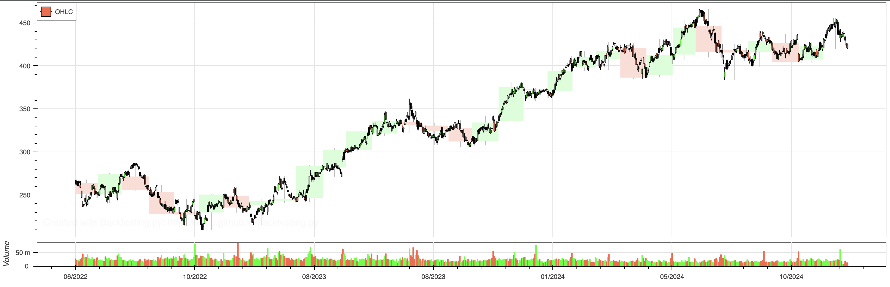

# 📈 MSFT_algo – Gradient Boosting for Stock Direction Forecasting

This repo builds a directional forecasting model for Microsoft (MSFT) stock using Gradient Boosting and validates it via historical backtesting. The model leverages macro features, technical indicators, and ensemble learning to generate buy/sell signals evaluated in a realistic trading simulation.

---

## 🔧 What’s Inside

- **Features**: MSFT, SPY, XLK, TNX, VIX – log returns, volumes, MA spreads
- **Models**: Gradient Boosting (best), plus XGBoost, Random Forest, Logistic Regression (on PCA)
- **CV**: TimeSeriesSplit to preserve temporal order
- **Backtest**: Uses `Backtesting.py` to simulate all-in/all-out trades on predicted signals

---

## Key Outcomes

- **Test Accuracy**: 52.5% (Gradient Boosting)
- **Backtest validates** profitable strategy despite noisy inputs
- Highlights why **accuracy alone isn't sufficient**—the model must avoid early capital loss and show robustness over time

Thanks to:
- [`backtesting.py`](https://github.com/kernc/backtesting.py) for the backtest engine
- [`scikit-learn`](https://scikit-learn.org/) for modeling
- [`yfinance`](https://pypi.org/project/yfinance/) for historical MSFT data
