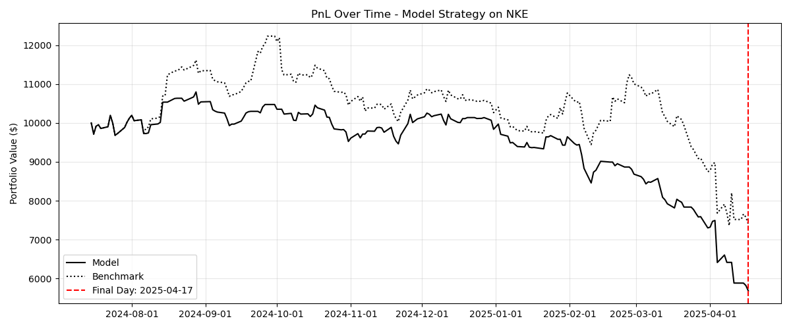

# SVM Trading Pipeline

This project builds an end-to-end **Support Vector Machine (SVM)** pipeline to backtest long/short trading signals on any stock using financial and macro features.

It includes:
- Feature engineering from log returns, VIX, SPY, XLK
- SVM classifier with time series cross-validation
- Signal generation (Buy/Sell/Hold)
- Strategy backtesting with benchmark comparison
- Clean PnL plotting (with final day annotation)

---

## Example Output



---

## How It Works

1. **Download market data** for the selected ticker + macro indicators
2. **Engineer features** using log returns and EWMA smoothing
3. **Train an SVM** with grid search (fast or slow runtime)
4. **Generate signals** -> +1 = buy, -1 = sell
5. **Simulate trading** and compare to buy-and-hold
6. **Visualize PnL**, final performance, and distribution

---

## Quick Start

> Install dependencies:
```bash
pip install -r requirements.txt
```
> Run in google colab or IDE
``` python
from ml_pipeline import SVMTradingPipeline
from run import run_full_backtest

params = {
    'ticker':'NKE',
    'start':'2010-01-01',
    'end':'2025-04-22',
    'test_prop':0.05,
    'initial_capital':10000,
    'plot_path':'model_vs_benchmark_PnL.png',
    'runtime':'fast'
}

results = run_full_backtest(**params)

# Can pull pd.DataFrame -> df = results[0]
```
