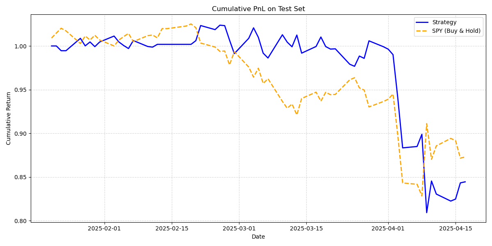

# ML-Based Trading Strategy (4-Model Ensemble)

This algorithm implements a 4-model ensemble for generating SPY trading signals using supervised machine learning.

## Overview

The model combines the outputs of four classifiers:
- Multinomial Logistic Regression
- Random Forest
- XGBoost
- LightGBM

Each model outputs class probabilities for a 3-class target: Buy (+1), Hold (0), or Sell (-1). Ensemble probabilities are weighted and aggregated to generate final trading signals.

## Pipeline

- Data preparation using `yfinance` and `ta`
- Feature engineering and selection
- Supervised model training and probability prediction
- Ensemble signal generation
- Backtesting vs SPY benchmark
- Visualizations: signal distribution, confusion matrix, and cumulative returns

## Set Up & Usage

Download data_preparation_pipeline.py and ml_model.py into your working directory. Then run the following,

```python
from data_preparation_pipeline import FinancialMLPipeline
from ml_model import MLTradingModel

model = MLTradingModel()
model.run()

# Tune accordingly!
# Hyperparameters - ensemble_weights=None,buy_threshold=0.005,sell_threshold=0.001,test_start='2025-01-20',xgb_max_depth=3,xgb_learn_rate=0.04,light_max_depth=3,light_learn_rate=0.03
# if ensemble_weights is None:
#   ensemble_weights = {'lr': 0.25, 'rf': 0.25, 'xgb': 0.25, 'lgb': 0.25}
```

## Example Output


